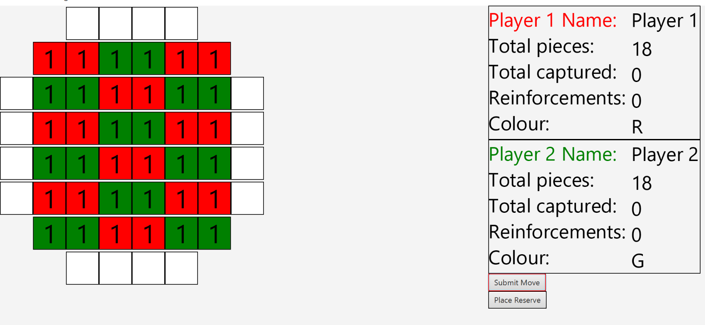

# JavaFocusDomination

## Overview
Java Focus Domination is a solo project that I embarked on with the aim of recreating one of the projects that I really enjoyed making during my
stage 1 Software Engineering module at UCD. The project was limited to a terminal due to us using C programming, so, I decided
to use an Object-Oriented Programming language (Java) to complete a remastered version of that project.
I had a lot of fun working on this solo project. I was able to put my project management skills to the test and expand my JavaFx knowledge.

### Focus Domination Rules 
Quick Note: The game in real life does allow for 4 players, however, this has not been implemented.
I do aim to eventually revisit this project and update the project to a 4 player version.
The rules of the game are quite simple. These rules are the rules we followed when making the original project. Some rules may b
1. Winning condition: If your opponent cannot make any moves, then you win!
2. To make a move, you can select a stack where the top piece is your colour, and move it either up down left or right.
3. Each stack can move up to n amount of times. n being the number of pieces in a stack.
4. A stack can only have max 5 pieces in it. So whenever a stack exceeds the number 5, pieces from the bottom will be either reserved (if the piece in question belongs to the current player) or captured (if the piece belongs to the opponent)
5. Reserved pieces can be brought in and placed anywhere at the start of your turn.
6. Captured pieces are not allowed into the game.
